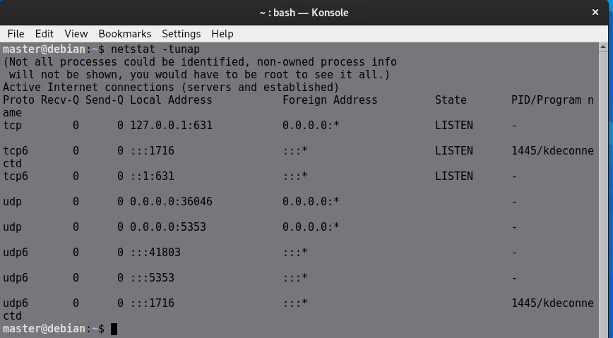
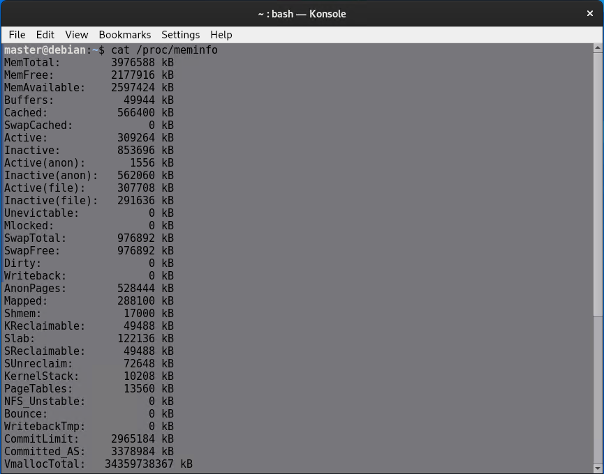
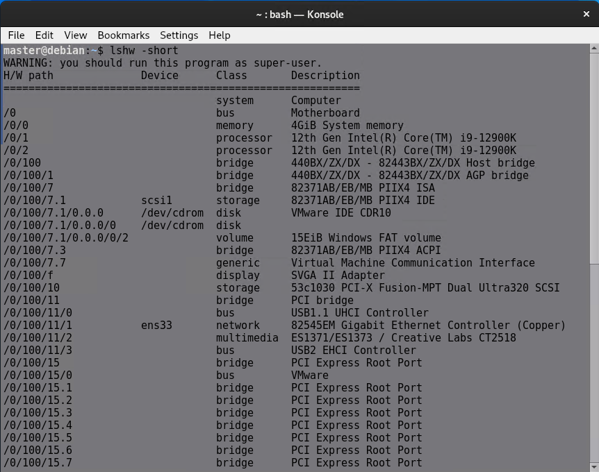
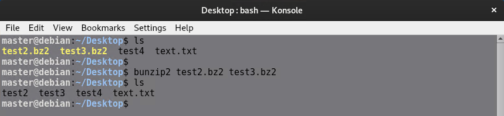
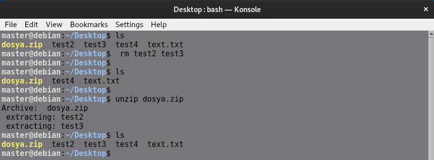

# **LİNUX KOMUTLARI**

## **1. Yardım Alma Komutları**

| Komut               | Açıklama |
|---------------------|---------|
| `<komut> --help`   | Komutun parametreleri ve argümanları hakkında bilgi verir. Bazen açıklama da içerebilir.|
| `man <komut>`      | Kılavuz (manual) sayfalarını açar, komut hakkında detaylı bilgi içerir. |
| `info <komut>`     | Man sayfasında olmayan veya daha detaylı bilgi içeren yardım dosyalarını gösterir. |
| `apropos <kelime>` | Verilen kelimenin geçtiği man dosyalarını listeler. |
| `whatis <komut>`   | Komut hakkında tek satırlık özet bilgi ve hangi man dosyasında olduğunu gösterir. |

 Bu komutlar ile istediğiniz bir komutun nasıl çalıştığı hakkında bilgi alabilirsiniz.

### **help**
Komut un parametre ve argümanı hakkında kullanım bilgisi verir. Bazen t anıtım bilgisi (açıklama) de
içerebilir

---
### **man**

Kılavuz sayfalarıdır. Manual anlamındadır. Detaylı yardım alma dosyalarıdır.
Man dosyaları yapısal olarak aşağıdaki gibidir:
- NAME: Komut un ismi ve açıklaması.
- SYNOPSIS: Komut un nasıl kullanılacağı.
- DESCRIPTION: Komut un işlevi hakkında det aylı bilgi.
- EXAMPLES: Kullanımıyla ilgili örnekler.
- SEE ALSO: Ayrıca bakılabiliecek olan İlgili başlıklar. 
Referanslar…

/usr/share/man path’i (yolu) altında bulunurlar.

- man1: Genel kullanıcı programları hakkındadır.
- man2: Sistem programları ve çağrıları hk.
- man3: Kütüphane fonksiyonları hk.
- man4: Sürücü ve aygıtlar (/dev) hk.
- man5: Dosya biçimleri hk.
- man6: Oyunlar ve ekran koruyucuları hk.
- man7: Diğer kategorideki çeşitli komutlar hk.
- man8: Sistem yönetimi ve bakım komutları hk.

`man ping` komutunu kullandığınızda aşağıdaki gibi bir kılavuz sayfası gelir sayfanın devamına ok tuşları ile bakabilirsiniz.

---

### **info**
Man sayfasında bulunmayan komut lar için yardımcı olabilecek 3.
parti bir uygulamadır. Eğer kurulu değilse root kullanıcısıyla 

`apt install info` komutuyla kurulabilir.

`info ping` komutunu kullandığınızda aşağıdaki gibi bir kılavuz sayfası gelir sayfanın devamına ok tuşları ile bakabilirsiniz.

---

### **apropos**

Verilen ifadeyi içeren geçtiği man dosyalarını listeler. Hangi man dosyasınında olduğunu parantez içinde yazar.

---
### **whatis**

Komut hakkında t ek sat ırlık özet bilgi ve hangi man dosyasında bulunduğunu gösterir.

`whatis -w <komutun bir kısmı>*` şeklindeki kullanımı ile komutun bir kısmını yazıp buna uygun olan komutları listelemesini sağlayabilirsiniz.

---

## **2. Bilgi Alma Komutları**

| Komut | Açıklama |
|--------|------------|
| `lsb_release -a` | Kullanılan Linux dağıtımı hakkında ayrıntılı bilgi verir. (`neofetch` uygulaması da kullanılabilir.) |
| `cat /etc/issue` | Kullanılan Linux dağıtımının adını gösterir. |
| `uname -a` | Kullanılan Linux çekirdeği (kernel) ve versiyonu hakkında bilgi verir. `-n`, `-m`, `-r` parametreleriyle daha az ayrıntılı bilgi alınabilir. |
| `hostname` | Bilgisayar adını (hostname) verir. |
| `w` | Aktif kullanıcıları, oturum açma saatlerini ve son açtıkları uygulamaları gösterir. |
| `who` | Aktif kullanıcıları ve giriş saatlerini gösterir. |
| `whoami` | Geçerli kullanıcı adını gösterir. `-b` ve `-r` parametreleriyle de kullanılabilir. |
| `uptime` | Sistemin ne kadar süredir açık olduğunu gösterir. |
| `date` | Günün tarih, saat ve dilimini gösterir.| 
|`ncal` |uygulaması ile takvim de görüntülenebilir. |
| `ifconfig` / `ip a` | Ethernet isimlerini ve IP yapılandırmalarını gösterir. |
| `netstat -tunap` | Aktif TCP-UDP bağlantıları, portlar ve bağlantıdaki programlar hakkında bilgi verir. |
| `cat /proc/cpuinfo` | CPU hakkında detaylı bilgi verir. (`lscpu` komutu daha özet, `cpu-x` uygulaması daha görseldir.) |
| `cat /proc/meminfo` / `free -mh` | RAM ve durumu hakkında detaylı bilgi verir. |
| `vmstat -t` / `-td` / `-tD` | Sistem performansı hakkında anlık genel bilgi verir. (`htop` uygulaması daha gelişmiş bilgi sunar.) |
| `lshw -short` / `hwinfo --short` | Sistem donanımları hakkında detaylı bilgi verir. (`inxi -Fx` de kullanılabilir.) |
| `lsusb` | Takılı USB aygıtları hakkında bilgi verir. |
| `df -h -T` / `lsblk` / `fdisk -l` | Fiziksel ve mantıksal disk kullanımı ile dosya sistemi hakkında bilgi verir. |
| `du -hc <argüman>` | Belirtilen dizin altındaki boyut kullanım değerlerini gösterir. (`ncdu` uygulaması da kullanılabilir.) |

Bu komutlar ile kullandığınız makina ve işletim sistemi hakkında bilgiler alabilirsiniz.

### **lsb_release -a**
Kullanılan Linux dağıtımı (distro’su) hakkında ayrıntılı bilgiverir. 

---
### **cat /etc/issue**
Kullanılan Linux dağıtımının adını gösterir. cat komutu aslında bir yazdırma komutudur yani bir dosyanın içeriğini terminale yazdırırı

---
### **uname**
Kullanılan Linux dağıtımnın çekirdek (kernel) adını ve versiyonu hakkında bilgi verir.
-n, -m, -r paramet releriyle daha ayrınt ısız bilgi alınabilir.

### **hostname**
Bilgisayar adını (hostname) verir.

---
### **w , who , whoami**
`w`	Aktif kullanıcıları, oturum açma saatlerini ve son açtıkları uygulamaları gösterir.

`who`	Aktif kullanıcıları ve giriş saatlerini gösterir.

`whoami`	Geçerli kullanıcı adını gösterir. -b ve -r parametreleriyle de kullanılabilir.

---

### **uptime**
Sistemin ne kadar süredir açık olduğunu gösterir.

---

### **date**
 Günün tarih, saat ve dilimini gösterir.

 

---

### **ncal**

ncal uygulaması ile takvim de görüntülenebilir. Uygulama kurmak için yetkili bir kullanıcı ile `apt install ncal ` komutunu çalıştımanız yeterlidir.

 

---
### **ifconfig / ip a**
Ethernet isimlerini ve IP yapılandırmalarını gösterir.

ifconfig kullanmak için yetkili bir kullanıcı olmak gerekir

---

### **netstat -tunap**
Aktif TCP-UDP bağlantıları, portlar ve bağlantıdaki programlar hakkında bilgi verir. tunap 5 farklı seçeneğin bir araya gelmiş halidir seçenekleri -t -u -n -a -p şeklinde tek tek kullanabilirsiniz ayrıntılı bilgi için netstat komutunun help ve man sayfalarını inceleyin 

---

### **cat /proc/cpuinfo**
İşlem birimlerinizin her biri hakkında detaylı bilgi verir.`lscpu` komutu daha özet, `cpu-x` uygulaması daha görseldir.

cpu-x kullanmadan önce kurmanız gerekir.`apt install cpu-x`

---

### **cat /proc/meminfo / free -mh**
RAM ve durumu hakkında detaylı bilgi verir.

---

### **vmstat -t / -td / -tD**
Sistem performansı hakkında anlık genel bilgi verir. `htop` uygulaması daha gelişmiş bilgi sunar.

---

### **lshw -short / hwinfo --short**
Sistem donanımları hakkında detaylı bilgi verir. (`inxi -Fx` de kullanılabilir.)

hwinfo için kurulum gerekir.

---

### **lsusb**
Takılı USB aygıtları hakkında bilgi verir.

---

### **df -h -T / lsblk / fdisk -l**
Fiziksel ve mantıksal disk kullanımı ile dosya sistemi hakkında bilgi verir.

fdisk kurulum ve yetkili kullanıcı gerektirir.

---

### **du -hc <argüman>**
Belirtilen dizin altındaki boyut kullanım değerlerini gösterir.`ncdu` uygulaması da kullanılabilir.

ncdu uygulamasını kurduktan sonra `ncdu ` kodunu çalıştırdığınızda bulunduğunuz dizinin altındaki bütün dizinlerin ve dosyaların boyutunun gösterildiği bir sayfa açılır.

---

## **3. İçerik KOmutları**

| Komut               | İşlev |
|---------------------|------------------------------------------------|
| `pwd`              | Hangi dizinde olduğunuzu gösterir. |
| `cd <dizin>`       | Belirtilen dizine girer. |
| `ls <dizin>`     | Belirtilen dizinin içeriğini listeler. |
| `file <dosya>`   | Belirtilen dosya hakkında bilgi verir. |
| `whereis <argüman>` | Komut, dosya veya klasörün yolunu ve man dosyasındaki yerini gösterir. |
| `which <komut>`  | Komutun tam yolunu gösterir. |
| `type <komut>`   | Komutun türünü ve yerini gösterir. |

Bu komutlar ile dizinler arasında gezinmek, dosyaların içeriği hakkında bilgi almak ve sistemde yüklü komutların yerini belirlemek gibi işlemler yapabilirsiniz.

### **pwd**  
Hangi dizinde olduğunuzu gösterir.  

  

---  

### **cd <dizin>**  
Belirtilen dizine girer.  

- `cd`: Kullanıcının home dizinine gider. (`cd ~` gibi)  
- `cd ..`: Bir üst dizine gider.  
- `cd ../../`: İki üst dizine gider. ("/" adedi kadar üst dizine çıkar)  
- `cd ../<dizin>`: Önce üst dizine, ardından belirtilen dizine gider.  
- `cd -`: En son bulunduğunuz iki dizin arasında geçiş yapar.  

  

---  

### **ls <dizin>**  
Belirtilen dizinin içeriğini listeler.  

- `ls <dizin>`: Belirtilen dizinin içeriğini listeler.  
- `ls -l`: Ayrıntılı listeleme yapar.  
- `ls -la`: Ayrıntılı ve gizli dosyaları da içeren listeleme yapar.  
- `ls -S`: Boyut büyüklüğüne göre sıralar.  
- `ls -lh`: Boyutları daha anlaşılır bir formatta listeler.  
- `ls -lt`: Değişiklik tarihine göre sıralar.  

  

  

---  

### **file <dosya>**  
Belirtilen dosya hakkında bilgi verir.  

  

---  

### **whereis <argüman>**  
Komut, dosya veya klasörün yolunu ve man dosyasındaki yerini gösterir.  

  

---  

### **which <komut>**  
Komutun tam yolunu gösterir.  

  

---  

### **type <komut>**  
Komutun türünü ve yerini gösterir.  

  

---

## **4. Dosya ve Dizin Komutları**

| Komut               | İşlev                                                                 |
|---------------------|-----------------------------------------------------------------------|
| `mkdir <dizinadı>`   | Dizin oluşturma komutudur. `mkdir dizin1 dizin2 dizin3` şeklinde topluca oluşturulabilir. |
| `touch <dosyaadı>`   | Dosya oluşturma komutudur. `touch dosya1 dosya2 dosya3` şeklinde topluca oluşturulabilir. |
| `cp <kaynak> <hedef>` | Dosya kopyalama komutudur. `-i` parametresi ile onay istenir. `-r` parametresi ile dizinler kopyalanabilir. |
| `mv <kaynak> <hedef>` | Dosya taşıma komutudur. İsim değişikliği için de kullanılabilir. `mv <dosyadı> <dosyaadı.uzantısı>` |
| `rm <dosya/dizin>`   | Dosya silme komutudur. `-r` parametresiyle dizinler de silinebilir. `-ri` ile onay istenir, `-rf` ile sorgusuz silme yapılır. |
| `cat <dosyaadı>`     | Dosya okuma komutudur. `-n` parametresi ile satırlar numaralı gösterilir. |
| `nl <dosyaadı>`      | `cat` komutuyla aynı işlevi görür, dosya satırlarını numaralandırarak gösterir. |
| `echo “ifade”`                     | CLI’a veya dosyalara ifade yazmak için kullanılır.|
| `more` ve `less <dosya>`           | Uzun çıktıları daha rahat (bölümlü) okunmalarını sağlarlar. `less`, `more`'dan daha gelişmiştir, büyük dosyalarda daha hızlıdır ve geriye dönük okuma yapabilir. |
| `head` ve `tail <dosya>`           | Çıktıların ilk 10 veya son 10 satırını görüntüler. `-n` parametresiyle 10 değeri değiştirilebilir. |
| `sort <dosya>`                     | Bir dosya içerisindeki satır başı ifadeleri alfabetik sıralamayla listeler. |
| `grep <ifade> <dosya/dizin>`      | Bir ifadeyi dosya veya dizinde aramak için kullanılır. `-i` parametresiyle küçük/büyük harf duyarlılığı gözetmez, `-r` ile dizinlerde arama yapar, `-s` ile hata mesajlarını göstermez, `-v` ile tersine arama yapar. |
| `find <dizin> -name <ifade>`      | Belirli bir dizin içinde geçen ifadeleri (dosyaları) aramak için kullanılır. |
| `locate <dosya>`                   | İndekslenmiş (veritabanında bulunan) dosyalar için arama yapar. Find'ten hızlıdır, ancak veritabanı kullanır. `updatedb` komutuyla indeksi güncellenebilir. |

### **mkdir <dizinadı>**  
Dizin oluşturma komutudur. 

---

### **touch <dosyaadı>**  
Dosya oluşturma komutudur. 

---

### **cp <kaynak> <hedef>**  
Dosya kopyalama komutudur. `-i` parametresi ile onay istenir. `-r` parametresi ile dizinler kopyalanabilir.  

---

### **mv <kaynak> <hedef>**  
Dosya taşıma komutudur. İsim değişikliği için de kullanılabilir. `mv <dosyadı> <yeni dosyaadı>`  

---

### **rm <dosya/dizin>**  
Dosya silme komutudur. `-r` parametresiyle dizinler de silinebilir. `-ri` ile onay istenir, `-rf` ile sorgusuz silme yapılır.  

---

### **cat <dosyaadı>**  
Dosya okuma komutudur. `-n` parametresi ile satırlar numaralı gösterilir.  

---

### **nl <dosyaadı>**  
`cat` komutuyla aynı işlevi görür, dosya satırlarını numaralandırarak gösterir.  

---

### **echo “ifade”**  
CLI’a veya dosyalara ifade yazmak için kullanılır.  

---

### **more** ve **less <dosya>**  
Uzun çıktıları daha rahat (bölümlü) okunmalarını sağlarlar. `less`, `more`'dan daha gelişmiştir, büyük dosyalarda daha hızlıdır ve geriye dönük okuma yapabilir.  

`more /proc/cpuinfo ` ve `less /proc/cpuinfo` komutları ile uzun bir dosyanın more ve less ile nasıl görüntülendiğini görebilirsiniz.

---

### **head** ve **tail <dosya>**  
Çıktıların ilk 10 veya son 10 satırını görüntüler. `-n` parametresiyle 10 değeri değiştirilebilir. 

---

### **sort <dosya>**  
Bir dosya içerisindeki satır başı ifadeleri alfabetik sıralamayla listeler.  

Aşağıda aynı dosyanın sor ve cat ile ayzdırılmış halleri gösterilmiştir.

---

### **grep <ifade> <dosya/dizin>**  
Bir ifadeyi dosya veya dizinde aramak için kullanılır. `-i` parametresiyle küçük/büyük harf duyarlılığı gözetmez, `-r` ile dizinlerde arama yapar, `-s` ile hata mesajlarını göstermez, `-v` ile tersine arama yapar.  

---

### **find <dizin> -name <ifade>**  
Belirli bir dizin içinde geçen ifadeleri (dosyaları) aramak için kullanılır. 

---

### **locate <dosya>**  
İndekslenmiş (veritabanında bulunan) dosyalar için arama yapar. Find'ten hızlıdır, ancak veritabanı kullanır. `updatedb` komutuyla indeksi güncellenebilir.  

---

## **5. Komut Operatörleri**

| Operatör                    | İşlev                                                                 |
|-----------------------------|-----------------------------------------------------------------------|
| `<komut> > <dosyaadı>`       | Komutun çıktısını belirtilen dosyaya yazdırır. (Dosyadaki ifadeleri ezer.) |
| `<komut> >> <dosyaadı>`      | Komutun çıktısını belirtilen dosyaya yazdırır. (Dosyadaki ifadeleri ezmez.) |
| `<komut1> \| <komut2>`        | Önceki komutun çıktısını, sonraki komuta girdi olarak gönderir.      |
| `<komut1> ; <komut2>`        | Önceki komut bittiğinde sonraki komutu çalıştırır.                   |
| `<komut1> & <komut2>`        | Komutlar başarı durumuna bakmaksızın arka planda aynı anda çalıştırılır. |
| `<komut> &`                  | Komut arka planda çalıştırılır.                                      |
| `<komut1> && <komut2>`       | Önceki komutun başarılı olması halinde sonraki komut çalıştırılır.    |
| `<komut1> \|\| <komut2>`       | Önceki komutun başarısız olması halinde sonraki komut çalıştırılır.    |

### **>**  
Komutun çıktısını belirtilen dosyaya yazdırır. (Dosyadaki ifadeleri ezer.)  

---

### **>>**  
Komutun çıktısını belirtilen dosyaya yazdırır. (Dosyadaki ifadeleri ezmez.)  

---

### **|**  
Önceki komutun çıktısını, sonraki komuta girdi olarak gönderir. 

---

### **;**  
Önceki komut bittiğinde sonraki komutu çalıştırır.  

---

### **&**  
Komutlar başarı durumuna bakmaksızın arka planda aynı anda çalıştırılır.  

Bu komuutan sonra 10 saniye bitince reboot atılır.

---

### **&&**  
Önceki komutun başarılı olması halinde sonraki komut çalıştırılır.  

---

### **||**  
Önceki komutun başarısız olması halinde sonraki komut çalıştırılır.  

## **6. Bölüm Arşiv Komutları ve Yönetimi**

| Komut                                      | İşlev                                                                                       |
|--------------------------------------------|---------------------------------------------------------------------------------------------|
| `tar cf arsiv.tar <dosyalar>`              | Dosyaları arşivleme komutudur. Sıkıştırma uygulamaz. `c=create`, `f=file`'ı temsil eder.   |
| `tar xfv arsiv.tar`                        | Arşivden çıkarma komutudur. `x=extract`, `f=file`, `v=verbose`'u temsil eder.              |
| `tar cfz arsiv.tgz/tar.gz <dosyalar>`      | Dosyaları Gzip kullanarak sıkıştırma ve arşivleme komutudur. `z=zip`'i temsil eder.         |
| `tar xfzv arsiv.tgz/tar.gz`                | Gzip dosyalarını çıkarma komutudur. (`-C` parametresiyle farklı bir path'e çıkarılabilir.)   |
| `tar cfj arsiv.tar.bz2 <dosyalar>`         | Dosyaları Bzip2 kullanarak sıkıştırma ve arşivleme komutudur.                               |
| `tar xfjv arsiv.tar.bz2`                   | Bzip2 dosyalarını çıkarma komutudur. (`-C` parametresiyle farklı bir path'e çıkarılabilir.) |
| `zcat arsiv.tgz`                           | Gzip dosyalarının içeriğini okuma/listeme komutudur. (`.tar` dosyalarını okumaz.)           |
| `bzcat arsiv.bz2`                          | Bzip2 dosyalarının içeriğini okuma/listeme komutudur. (`.tar` dosyalarını okumaz.)          |
| `gzip dosya1 dosya2`                       | Dosyaları sıkıştırma komutudur. Dosyalar `.gz` uzantısına dönüşür.                          |
| `gunzip dosya1.gz dosya2.gz`               | Gz dosyalarını çıkarma komutudur.                                                           |
| `bzip2 dosya1 dosya2`                      | Dosyaları sıkıştırma komutudur. Dosyalar `.bz2` uzantısına dönüşür.                         |
| `bunzip2 dosya1.bz2 dosya1.bz2`            | Bz2 dosyalarını çıkarma komutudur.                                                         |
| `zip arsiv.zip <dosyalar>`                 | Dosyaları zip kullanarak sıkıştırma ve arşivleme komutudur.                                 |
| `unzip arsiv.zip`                          | Zip dosyalarını çıkarma komutudur.                                                         |
| `unrar arsiv.rar`                          | Rar dosyalarını çıkarma komutudur. (`unrar-free` ile gelir.)                               |

### **Arşivleme (tar cf arsiv.tar <dosyalar>)**  
Dosyaları arşivleme komutudur. Sıkıştırma uygulamaz. `c=create`, `f=file`'ı temsil eder.  

---

### **Arşivden Çıkarma (tar xfv arsiv.tar)**  
Arşivden çıkarma komutudur. `x=extract`, `f=file`, `v=verbose`'u temsil eder.

---

### **Sıkıştırarak Arşivleme (tar cfz arsiv.tgz/tar.gz <dosyalar>)**  
Dosyaları Gzip kullanarak sıkıştırma ve arşivleme komutudur. `z=zip`'i temsil 
eder.  

---

### **Gzip Dosyalarını Çıkarma (tar xfzv arsiv.tgz/tar.gz)**  
Gzip dosyalarını çıkarma komutudur. (`-C` parametresiyle farklı bir path'e çıkarılabilir.)  

---

### **Sıkıştırarak Arşivleme (tar cfj arsiv.tar.bz2 <dosyalar>)**  
Dosyaları Bzip2 kullanarak sıkıştırma ve arşivleme komutudur.  

---

### **Bzip2 Dosyalarını Çıkarma (tar xfjv arsiv.tar.bz2)**  
Bzip2 dosyalarını çıkarma komutudur. (`-C` parametresiyle farklı bir path'e çıkarılabilir.)  

---

### **İçerik Okuma (zcat arsiv.tgz)**  
Gzip dosyalarının içeriğini okuma/listeme komutudur. (`.tar` dosyalarını okumaz.)  

---

### **İçerik Okuma (bzcat arsiv.bz2)**  
Bzip2 dosyalarının içeriğini okuma/listeme komutudur. (`.tar` dosyalarını okumaz.)  

---

### **Sıkıştırma (gzip dosya1 dosya2)**  
Dosyaları sıkıştırma komutudur. Dosyalar `.gz` uzantısına dönüşür.  

---

### **Gz Dosyalarını Çıkarma (gunzip dosya1.gz dosya2.gz)**  
Gz dosyalarını çıkarma komutudur.  

---

### **Sıkıştırma (bzip2 dosya1 dosya2)**  
Dosyaları sıkıştırma komutudur. Dosyalar `.bz2` uzantısına dönüşür. 

---

### **Bz2 Dosyalarını Çıkarma (bunzip2 dosya1.bz2 dosya1.bz2)**  
Bz2 dosyalarını çıkarma komutudur.  

---

### **Zip Arşivleme (zip arsiv.zip <dosyalar>)**  
Dosyaları zip kullanarak sıkıştırma ve arşivleme komutudur.  

---

### **Zip Dosyalarını Çıkarma (unzip arsiv.zip)**  
Zip dosyalarını çıkarma komutudur.  

---

